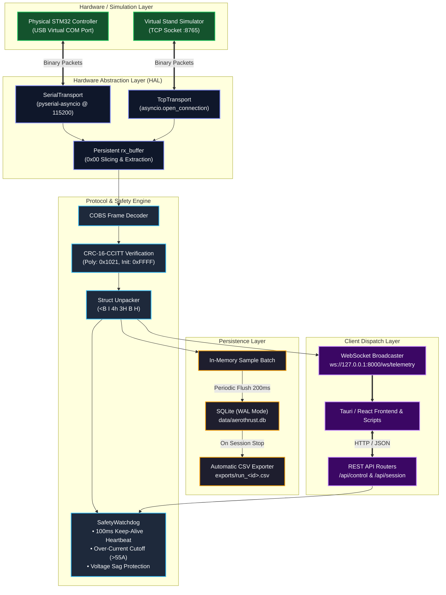

# AeroThrust V3 — Backend Telemetry & Control Core

The **AeroThrust V3 Backend** is an asynchronous daemon built with **FastAPI** and **Python 3.10+ AsyncIO**. It serves as the real-time communications bridge, safety watchdog, and data persistence engine for UBC AeroDesign’s next-generation propulsion test stand and wind tunnel instrumentation rig.

---

## 1. System Architecture & Telemetry Pipeline

The backend operates on a single-threaded asynchronous event loop, eliminating Python Global Interpreter Lock (GIL) thread contention while sustaining non-blocking $50\text{ Hz}$ data ingestion, safety monitoring, and client streaming.



---

## 2. Directory Layout & Module Responsibilities

```text
backend/
├── app/
│   ├── core/
│   │   ├── config.py         # System paths, safety thresholds, timing intervals
│   │   └── protocol.py       # COBS codec, CRC-16 computation, binary struct packing
│   ├── hal/
│   │   ├── base.py           # Abstract BaseTransport interface
│   │   ├── tcp_transport.py  # Asynchronous TCP client for the virtual simulator
│   │   └── serial_transport.py # Asynchronous USB serial client for STM32
│   ├── routers/
│   │   ├── control.py        # REST endpoints: connect, disconnect, throttle, tare, estop
│   │   ├── session.py        # REST endpoints: start, stop, and CSV export
│   │   └── telemetry.py      # Real-time WebSocket streaming route
│   ├── services/
│   │   ├── connection_manager.py # Hardware state orchestration & client broadcasting
│   │   ├── safety_watchdog.py    # Cyclic heartbeat pings and tripwire monitoring
│   │   └── storage_service.py    # SQLite WAL batch writer and CSV generator
│   ├── __init__.py
│   └── main.py               # FastAPI application setup, CORS, and lifespan hooks
├── requirements.txt          # Python dependencies
└── run.py                    # Server launcher script
```

---

## 3. Core Subsystems

### A. Binary Framing & Error Detection (`app/core/protocol.py`)
To prevent communication lockups caused by motor electromagnetic interference (EMI), the backend rejects unverified ASCII strings:
* **Framing:** Uses **Consistent Overhead Byte Stuffing (COBS)** so the byte `0x00` exclusively marks the End-of-Packet (EOP).
* **Integrity:** Every inbound and outbound frame is protected by a **CRC-16-CCITT** checksum ($x^{16} + x^{12} + x^5 + 1$). Packets failing the CRC check are dropped immediately.
* **Telemetry Payload (22 bytes unencoded):**
  ```text
  Format: <B I 4h 3H B H
  [0]    uint8   packet_id (0x01)
  [1-4]  uint32  uptime_ms
  [5-12] 4x int16 load_cells (Thrust, Torque, CH3, CH4 in grams)
  [13-14] uint16 voltage_centi (10 mV scale)
  [15-16] uint16 current_centi (10 mA scale)
  [17-18] uint16 motor_rpm (D-Shot digital telemetry)
  [19]   uint8   status_flags (Bit 0: Armed, Bit 1: E-Stop, Bit 2: D-Shot)
  [20-21] uint16 crc16
  ```

### B. Hardware Abstraction Layer (HAL) (`app/hal/`)
The backend is completely decoupled from the physical transport medium:
* **`TcpTransport`:** Connects to `127.0.0.1:8765` to stream from the offline physics simulator (`sim/virtual_stand.py`).
* **`SerialTransport`:** Uses `pyserial-asyncio` to interface with the STM32 via USB CDC at $115{,}200\text{ baud}$.
* Both adapters implement `read_frame()` and `write_packet()`, enabling instant switching between physical hardware and virtual testing without restarting the application logic.

### C. Safety Watchdog & Tripwires (`app/services/safety_watchdog.py`)
Physical safety is enforced through multiple redundant mechanisms:
1. **Cyclic Heartbeat:** The backend transmits a keep-alive packet (`0xAA`) every **100 ms**. If communication is lost and the stand misses pings for $>250\text{ ms}$, the hardware autonomously cuts throttle to 0%.
2. **Over-Current Tripwire:** If measured current exceeds `DEFAULT_MAX_CURRENT_AMPS` ($55.0\text{ A}$), an immediate Emergency Stop packet is sent.
3. **Low-Voltage Cutoff:** Alerts are raised if pack voltage sags below critical thresholds ($9.9\text{V}$ for 3S Micro, $13.2\text{V}$ for 4S Advanced).
4. **Immediate E-Stop:** Firing the E-Stop (`POST /api/control/estop`) overrides any running test, drives the throttle command to 0%, and disarms the speed controller.

### D. Persistence & Auto-Export (`app/services/storage_service.py`)
* **Local Database:** Writes to `data/aerothrust.db` using **SQLite Write-Ahead Logging (WAL)** (`PRAGMA journal_mode = WAL;`). WAL allows concurrent reading and writing without database locks.
* **Non-Blocking Batching:** Samples are accumulated in memory and written in bulk every **200 ms** inside an off-thread executor (`loop.run_in_executor`) to prevent disk writes from pausing the async loop.
* **Auto-Export:** Calling `POST /api/session/stop` automatically flushes any remaining in-memory samples and writes a fully populated CSV file to `exports/run_<run_id>.csv`.

---

## 4. API Reference

Interactive OpenAPI (Swagger) documentation is available at **`http://127.0.0.1:8000/docs`**.

### Hardware & Throttle Control (`/api/control`)
* **`POST /api/control/connect`**: Connect to hardware or simulator.
  ```json
  // Simulator:
  {"mode": "simulator"}
  // Physical USB:
  {"mode": "serial", "port": "COM3", "baudrate": 115200}
  ```
* **`POST /api/control/disconnect`**: Closes connection and stops watchdog tasks.
* **`POST /api/control/throttle`**: Commands motor speed (0% to 100%).
  ```json
  {"throttle_pct": 35.0, "mode": "dshot"}
  ```
* **`POST /api/control/tare`**: Zeroes load cell channels (default mask `0x0F` zeroes all 4 channels).
* **`POST /api/control/estop`**: Triggers an immediate emergency stop.

### Test Session Management (`/api/session`)
* **`POST /api/session/start`**: Begins recording telemetry to SQLite.
  ```json
  {
    "name": "Micro_Static_Sweep_01",
    "competition_class": "MCR",
    "motor_model": "Sunnysky 2216 1250KV",
    "propeller_model": "APC 10x4.7 SF",
    "battery_config": "3S 1000mAh",
    "notes": "Testing static thrust baseline for 2027 Micro TDS"
  }
  ```
* **`POST /api/session/stop`**: Flushes queue, concludes recording, and generates the CSV export.
  ```json
  // Returns:
  {
    "status": "stopped",
    "run_id": "c60ac861",
    "exported_csv": "C:\\...\\exports\\run_c60ac861.csv"
  }
  ```
* **`GET /api/session/{run_id}/export`**: Download the exported CSV file directly.

### Live Telemetry WebSocket (`/ws/telemetry`)
* **Endpoint:** `ws://127.0.0.1:8000/ws/telemetry`
* **Rate:** Broadcasts JSON payloads at $50\text{ Hz}$ to all connected clients:
  ```json
  {
    "uptime_ms": 12450,
    "thrust_g": 1420,
    "torque_g": 128,
    "ch3_g": 0,
    "ch4_g": 0,
    "voltage_v": 11.45,
    "current_a": 28.30,
    "power_w": 324.04,
    "rpm": 8450,
    "flags": 13,
    "armed": true,
    "estop": false
  }
  ```

---

## 5. Setup & Development Guide

### Prerequisites
* Python **3.10** or higher
* `pip` package manager

### Installation
1. Navigate to the repository root and activate a virtual environment:
   ```bash
   python -m venv .venv
   # Windows (PowerShell):
   .venv\Scripts\Activate.ps1
   # macOS/Linux:
   source .venv/bin/activate
   ```
2. Install the backend dependencies:
   ```bash
   pip install -r backend/requirements.txt
   ```

### Running with the Virtual Simulator (Offline Testing)
Open two terminal windows:

**Terminal 1 — Launch Simulator:**
```bash
python sim/virtual_stand.py
```

**Terminal 2 — Launch Backend Daemon:**
```bash
python backend/run.py
```
The backend will launch at `http://127.0.0.1:8000` with hot-reload enabled.

---

## 6. End-to-End Verification Script

You can verify the entire control and logging pipeline using standard `curl` commands in a third terminal:

```bash
# 1. Connect to virtual simulator
curl -X POST http://127.0.0.1:8000/api/control/connect \
     -H "Content-Type: application/json" \
     -d '{"mode": "simulator"}'

# 2. Start recorded session
curl -X POST http://127.0.0.1:8000/api/session/start \
     -H "Content-Type: application/json" \
     -d '{"name":"Baseline_Test","competition_class":"MCR","motor_model":"TestMotor","propeller_model":"10x4.7","battery_config":"3S"}'

# 3. Command 25% throttle (D-Shot)
curl -X POST http://127.0.0.1:8000/api/control/throttle \
     -H "Content-Type: application/json" \
     -d '{"throttle_pct": 25.0, "mode": "dshot"}'

# 4. Wait 3 seconds, then stop session (automatically exports CSV)
sleep 3
curl -X POST http://127.0.0.1:8000/api/session/stop
```

Verify that a newly populated file appears under `exports/run_<run_id>.csv` containing valid force and electrical data.

---

## 7. Common Troubleshooting

| Issue | Root Cause | Solution |
| :--- | :--- | :--- |
| `[FATAL ERROR] Could not bind to 127.0.0.1:8765` | A zombie Python process is already using the port. | Windows: `Get-Process python* \| Stop-Process -Force`<br>Linux/macOS: `pkill -f python` |
| `Failed to connect to simulator` | `virtual_stand.py` is not running. | Launch `python sim/virtual_stand.py` before issuing the connect call. |
| `Cannot set throttle: E-Stop is active` | Safety tripwire or manual E-Stop was engaged. | Disconnect and reconnect via `/api/control/connect` to reset the software watchdog state. |
| No serial ports found / permission denied | User lacks permissions on Linux, or COM port is held open by another app. | Linux: `sudo usermod -a -G dialout $USER`<br>Windows: Close Arduino IDE or other serial monitors holding the COM port. |
| CSV export empty or 0 samples | Session stopped immediately before samples were received. | Ensure hardware is connected and streaming telemetry *before* calling `/api/session/start`. |
