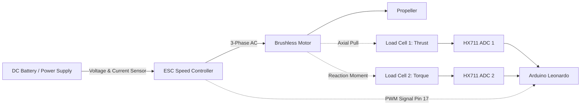

# 01 — System Overview & Physical Test Stand

## 1. What is a Thrust Stand?
A **Thrust Stand** is a stationary benchtop test rig used to evaluate electric aircraft propulsion systems (brushless motors, Electronic Speed Controllers (ESCs), and propellers) before they are mounted to an airframe.

When an electric motor spins a propeller:
1. It pulls air axially to generate **Thrust** ($T$).
2. It pushes against the motor mount with an equal and opposite reaction **Torque** ($\tau$).
3. It draws electrical energy from the battery, characterized by DC **Bus Voltage** ($V$) and **Current** ($I$).

---

## 2. Key Physical Metrics Derived

| Parameter | Unit | Calculation / Hardware Source | Purpose in Aircraft Design |
| :--- | :--- | :--- | :--- |
| **Thrust ($T$)** | grams-force ($g$) or Newtons ($N$) | Load Cell 1 via HX711 | Verifies takeoff and climb capability. ($1\text{ N} \approx 101.97\text{ g}$) |
| **Torque ($\tau$)** | $g\cdot cm$ or $N\cdot m$ | Load Cell 2 via HX711 | Measures motor load and rotational reaction forces. |
| **Bus Voltage ($V$)** | Volts ($V$) | Analog Pin 11 (6:1 Voltage Divider) | Monitors battery discharge and **voltage sag** under high load. |
| **Current ($I$)** | Amperes ($A$) | Analog Pin 10 (Current Shunt/Hall Sensor) | Prevents burning out the ESC or exceeding battery C-ratings. |
| **Input Power ($P_{\text{in}}$)** | Watts ($W$) | $P_{\text{in}} = V \times I$ | Measures total electrical power drawn from the battery. |
| **Propulsion Efficiency** | grams per Watt ($g/W$) | $\eta = \frac{\text{Thrust } (g)}{P_{\text{in}} (W)}$ | Determines how efficiently battery energy translates to thrust. |
| **Energy Consumed** | Milliamp-hours ($mAh$) | Numerical integration of Current over time | Simulates flight endurance against competition battery caps. |

---

## 3. Physical Calibration (Tare / Zeroing)
Because the motor, propeller, and mounting hardware exert a baseline gravitational force on the load cells, the software must perform a **Tare** before every test. Taring records the static resting reading as an offset ($Offset_{\text{cell}}$) and subtracts it from all active measurements:

$$\text{Net Measurement} = \text{Raw Sensor Reading} - \text{Tare Offset}$$