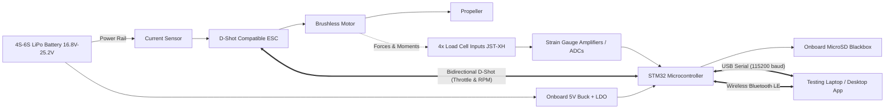

# 01 — System Overview & Test Rig Architecture

## 1. System Definition & Purpose
AeroThrust V3 is the ground control software for UBC AeroDesign's next-generation **Thrust Stand and Wind Tunnel Controller**. 

The hardware controller is designed around an **STM32 32-bit ARM microcontroller** and serves a dual role across the aerodynamics, propulsion, and flight mechanics sub-teams:
1. **Propulsion Thrust Stand Mode:** Characterizes electric motors, Electronic Speed Controllers (ESCs), and propellers under static bench loading.
2. **Wind Tunnel Strain Gauge Mode:** Functions as a 4-channel strain-gauge data acquisition amplifier to record aerodynamic forces (Lift, Drag, Side Force, and Moments) during wind tunnel testing.

---

## 2. Key Telemetry & Physical Metrics

| Metric | Source / Protocol | Units | Purpose in Aircraft Design |
| :--- | :--- | :--- | :--- |
| **Thrust / Normal Force** | Load Cell Channel 1 | grams ($g$) or Newtons ($N$) | Validates takeoff and climb capability. ($1\text{ N} \approx 101.97\text{ g}$) |
| **Reaction Torque** | Load Cell Channel 2 | $g\cdot cm$ or $N\cdot m$ | Evaluates motor torque resistance and rotational drag. |
| **Channels 3 & 4 Forces** | Load Cell Channels 3 & 4 | grams ($g$) or Newtons ($N$) | In Wind Tunnel mode: measures multi-axis forces (Lift, Drag, Pitching Moment). |
| **Rotational Speed (RPM)** | **Bidirectional D-Shot Telemetry** | Revolutions Per Minute (RPM) | Captured digitally from ESC without external optical sensors. Critical for aerodynamic validation. |
| **Bus Voltage ($V$)** | Dedicated Voltage Divider | Volts ($V$) | Monitors battery pack voltage and evaluates **voltage sag** under load across 4S to 6S packs. |
| **Current ($I$)** | Dedicated Current Sensor | Amperes ($A$) | Tracks electrical draw; prevents overloading ESCs or exceeding battery discharge C-ratings. |
| **Input Power ($P_{\text{in}}$)** | Computed ($V \times I$) | Watts ($W$) | Quantifies total electrical energy drawn from the battery. |
| **Mechanical Power ($P_{\text{mech}}$)** | Computed ($\tau \times \omega$) | Watts ($W$) | True shaft power calculated directly from torque and D-Shot RPM ($\omega = \text{RPM} \times \frac{2\pi}{60}$). |
| **Propulsion Efficiency** | Computed ($\text{Thrust} / P_{\text{in}}$) | grams per Watt ($g/W$) | Measures battery conversion efficiency; vital under the 2027 power limiter removal. |
| **Energy Consumed** | Numerical integration ($\int I \, dt$) | $mAh$ and $Watt\text{-}hours$ | Simulates battery depletion against the 1000 mAh (Micro) and 3000 mAh (Advanced) caps. |

---

## 3. Power Architecture & Electrical Safety
* **Wide Voltage Range:** Designed to accept **4S (14.8V nominal) to 6S (22.2V nominal)** LiPo batteries (up to 25.2V fully charged).
* **Isolated Laptop Protection:** The board features an onboard step-down buck converter (stepping battery voltage down to 5V and 3.3V) with high-side OR-ing isolation. This prevents the stand from drawing motor current through the laptop's USB port or back-feeding voltage into the host computer.
* **Dual Operation Modes:** The controller can run fully tethered via USB-C or completely standalone on battery power using Bluetooth Low Energy (BLE).

---

## 4. Physical Calibration (Multi-Channel Tare)
Because mechanical fixtures exert baseline resting forces on the load cells, the software supports individual channel taring as well as a master **"Tare All"** command:

$$\text{Net Force}_i = \text{Raw Sensor Reading}_i - \text{Tare Offset}_i \quad (i \in \{1, 2, 3, 4\})$$