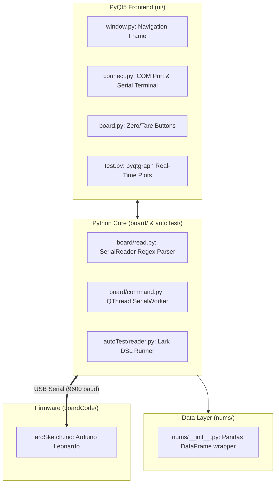

# 02 — Legacy Codebase Audit (`thrust-stand-v2`)

This document outlines the software architecture, data flow, and critical technical flaws identified in the legacy repository.

---

## 1. Component Review



* **Firmware (`boardCode/ardSketch/ardSketch.ino`):** Arduino Leonardo sketch reading 2x HX711 load cells, averaging analog $V$ and $I$ on pins 10/11, and generating standard RC servo PWM pulses on pin 17 via `Servo.h`.
* **Serial Interface (`board/`):** Reads serial data on a background `QThread` and uses regular expressions to parse text lines like `lc1(1200)` and `cur(14.5)`.
* **Automation Engine (`autoTest/`):** Uses the **Lark** parser library with `grammar.lark` to execute text scripts (e.g., `SET_THROTTLE 50`, `WAIT 2000`, `ADD_POINT`).
* **Data Storage (`nums/__init__.py`):** Collects data points into a Python list and writes them into a `pandas.DataFrame`.

---

## 2. Identified Bugs & Critical Anti-Patterns

### 1. Inverted Firmware Telemetry Flags (Functional Bug)
In `boardCode/ardSketch/ardSketch.ino`:
```cpp
if (vtg) {
  Serial.print("cur(");
  Serial.print(current);
  Serial.println(")");
}
if (cur) {
  Serial.print("vtg(");
  Serial.print(voltage);
  Serial.println(")");
}
```
* **Impact:** The code sends `cur(...)` when the voltage flag `vtg` is enabled and `vtg(...)` when the current flag `cur` is enabled.

### 2. Missing Emergency Stop Logic (Safety Hazard)
In `ardSketch.ino`, the command `stp` calls:
```cpp
void emergencyStop() {
    // Completely empty!
}
```
* **Impact:** Sending an emergency stop command does not alter PWM output or cut throttle.

### 3. Missing Hardware Watchdog / Heartbeat (Runaway Motor Risk)
* The Arduino does not check whether the computer is still alive. If the Python app crashes or the USB cable is disconnected while running at 100% throttle, **the motor will continue to spin indefinitely**.

### 4. Memory Allocation Bottleneck in Data Logging
In `nums/__init__.py`:
```python
newRow = pd.DataFrame(data, index=[0])
self.dataframe = pd.concat([self.dataframe, newRow], ignore_index=True)
```
* **Impact:** `pd.concat` creates a full copy of the dataframe in memory every time a row is added ($O(N^2)$ memory overhead). This causes cumulative UI stutter during high-frequency tests.

### 5. Inefficient Serial Parsing
* Transmitting raw ASCII strings (e.g., `lc1(1234)\n`) over 9600 baud requires heavy string formatting on the microcontroller and regex parsing (`re.match`) in Python, limiting the sampling rate to ~4 Hz.