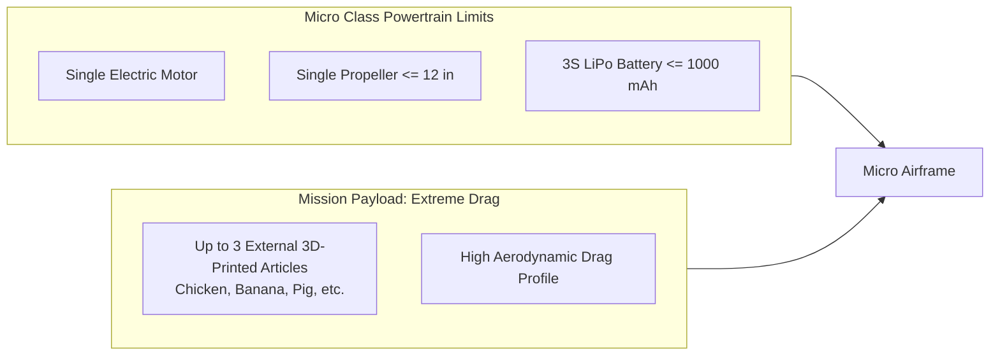

# 03 — 2027 SAE Aero Design Rules Alignment

The 2027 SAE Aero Design rules introduce fundamental changes to electric propulsion requirements. This document outlines how AeroThrust V3 directly supports UBC AeroDesign’s **Micro Class (MCR)** and **Advanced Class (ADV)** teams.

---

## 1. Universal Rule Changes Across All Classes

* **Power Limiters Are Removed (Sections 2.21, 7.3, 8.2, 9.2):**
  * *Previous Years:* An inline hardware circuit breaker automatically cut or throttled motors drawing $>1000\text{ W}$.
  * *2027 Rule:* Power limiters are **no longer required in any class**.
  * *Design Impact:* Motor power is now constrained strictly by **battery capacity and thermal dissipation**. The thrust stand must accurately track $mAh$ and $Wh$ energy consumption over simulated mission timelines.
* **Propulsion System Red Arming Plug (Section 2.22):** Must be placed on the positive (red) wire between battery and ESC, located $\ge 9\text{ inches}$ from any propeller rotational plane.
* **Radio Fail-Safe Requirement (Section 2.8):** All systems must immediately cut throttle to zero upon loss of control signal.

---

## 2. Micro Class (MCR) Specifications

* **Powertrain Limits (Section 9.2):** Exactly 1 motor, exactly 1 propeller ($\le 12''$), and a **3S LiPo pack (max 1000 mAh)**.
* **Mission Challenge:** The aircraft must overcome massive aerodynamic drag created by up to three externally attached 3D-printed articles (Section 9.3).
* **Mandatory TDS Report Graph (Section 4.7):**
  * Teams must submit a chart showing **Power Available ($P_{\text{avail}}$) vs. Power Required ($P_{\text{req}}$)** across flight speeds.
  * *Thrust Stand Role:* The aerodynamics team calculates theoretical airframe drag ($P_{\text{req}}$), but requires the thrust stand to provide real, empirical static and stepped thrust curves to determine true $P_{\text{avail}}$.

---

## 3. Advanced Class (ADV) Specifications

* **Powertrain Limits (Section 8.2):** Up to 3 electric motors and 3 propellers powered by a **4S LiPo pack (max 3000 mAh)**.
* **Airframe Weight Limit (Section 8.1):** Aircraft empty weight must not exceed **3.50 lbs**.
* **Mission Challenge (Section 8.4):** Autonomous takeoff, payload delivery to an $8 \times 8\text{ ft}$ Designated Landing Zone (DLZ), payload capture, and Return to Base (RTB) within a 4-minute mission window.
* *Thrust Stand Role:* ADV requires precise thrust-to-weight optimization to lift maximum payload within the strict 3.50 lb weight cap, along with multi-motor matching tests to balance multi-engine thrust.