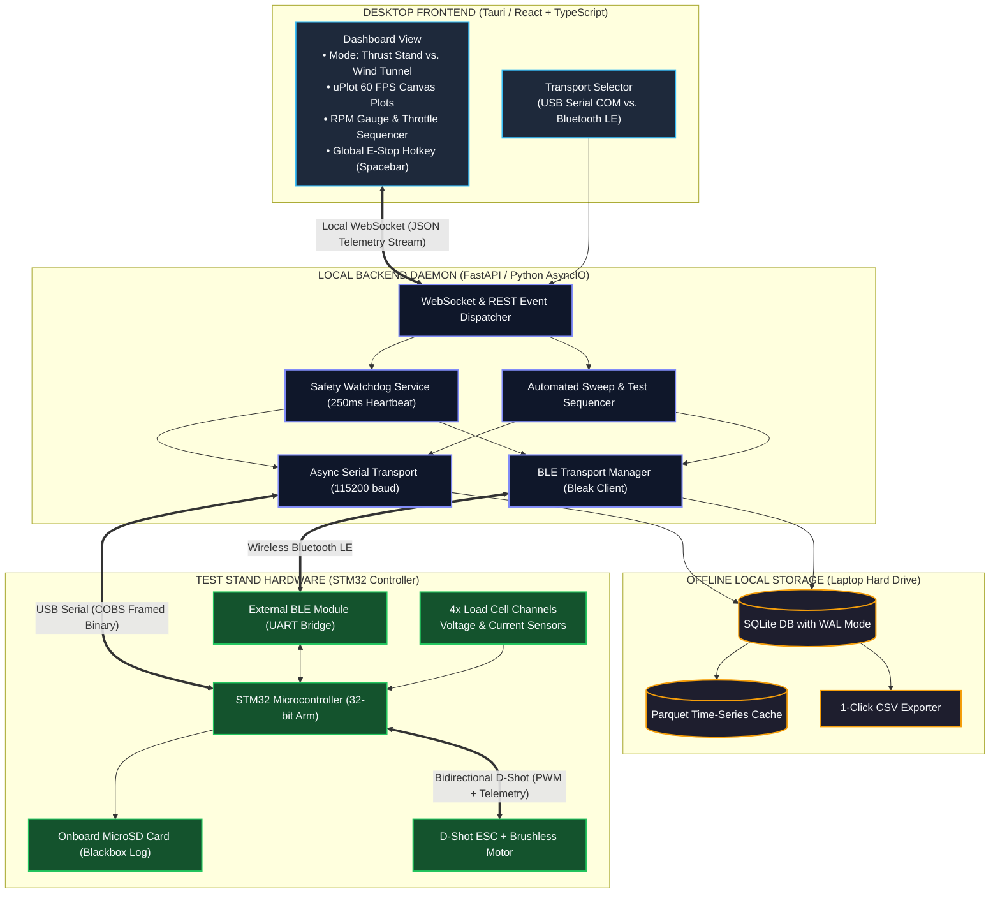

# 04 — System Architecture & Implementation

AeroThrust V3 uses a decoupled, event-driven desktop architecture designed for high-rate telemetry, safety watchdogs, and future ground station unification.

---

## 1. Architecture Flowchart

---

## 2. Key Architecture Components

### A. Dual Hardware Abstraction Layer (HAL)
The backend abstracts the physical communication link behind an abstract transport interface:
* **USB Serial Driver:** Uses asynchronous non-blocking serial polling (`pyserial-asyncio`) at **115,200 baud**.
* **Bluetooth Low Energy (BLE) Driver:** Uses Python's asynchronous `bleak` library to connect to the external BLE UART service.
* Both transports feed identically framed binary packets into the parser, meaning the UI and database pipelines remain completely agnostic to whether the test is wired or wireless.

### B. High-Speed Local Storage Engine
* **Offline-First SQLite (WAL Mode):** Operates serverless on the local testing laptop. Write-Ahead Logging (WAL) allows $50\text{ Hz}$ telemetry ingestion without locking queries or causing UI micro-stutters.
* **Onboard SD Card Blackbox Synchronization:** The STM32 hardware logs raw data to an onboard microSD card. If a Bluetooth connection experiences wireless packet drops during a test, the desktop application provides a **"Sync SD Blackbox"** utility to backfill any missing data points into SQLite.
* **Analysis-Ready Exports:** Standardized exports to `.csv` and `.parquet` enable immediate handoff to the aerodynamics sub-team for report generation.

### C. Mode Switching: Thrust Stand vs. Wind Tunnel
The system supports two operating contexts selectable in the header:
* **Thrust Stand Mode:** Visualizes Channels 1 & 2 as Thrust and Torque, displays motor RPM, and exposes throttle control sliders.
* **Wind Tunnel Mode:** Disables motor throttle controls and visualizes all 4 load cell channels simultaneously (configured for Lift, Drag, Side Force, and Moments) with multi-channel taring.