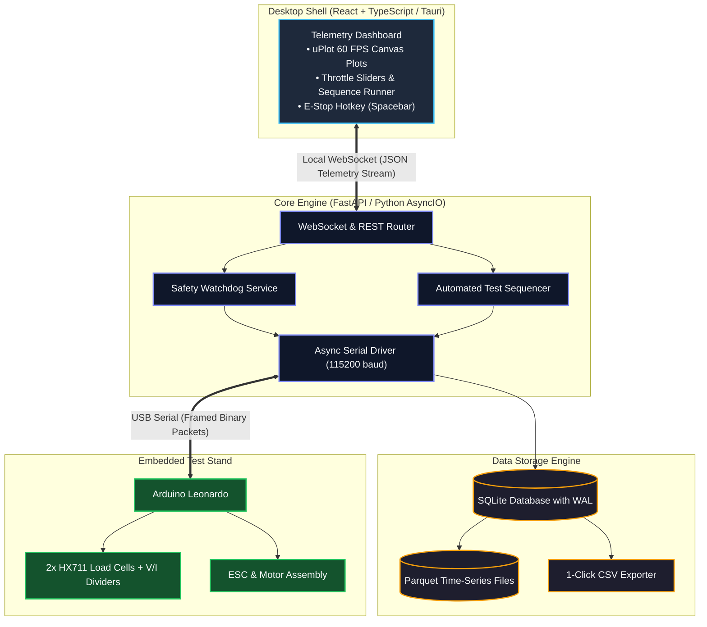

# 04 — Modernized Software Architecture

AeroThrust V3 transitions from a monolithic desktop GUI to a decoupled, service-oriented architecture matching the ground software sub-team’s unification strategy.

---

## 1. System Architecture

---

## 2. Key Architectural Decisions

1. **FastAPI Backend Core:**
   * Aligns directly with the DACSQY team's migration away from Redis to a lightweight FastAPI service.
   * Runs non-blocking asynchronous event loops (`asyncio`) to ensure incoming serial packets from the USB port never block or get delayed.
2. **Tauri + React/TypeScript UI:**
   * Modern, memory-safe desktop shell with a fraction of Electron’s footprint.
   * Enables building a shared library of ground-station UI components (gauges, serial connection bars, and charts) used by both AeroThrust and DACSQY.
3. **High-Performance Plotting (uPlot / Canvas):**
   * Replaces `pyqtgraph` with `uPlot`, rendering tens of thousands of data points at 60 FPS without memory leaks.
4. **Structured Storage (SQLite WAL / Parquet):**
   * Raw samples write directly to an embedded SQLite database using **Write-Ahead Logging (WAL)**. WAL allows rapid writes without locking the database file, completely eliminating the $O(N^2)$ memory copying bottleneck of Pandas `concat`.