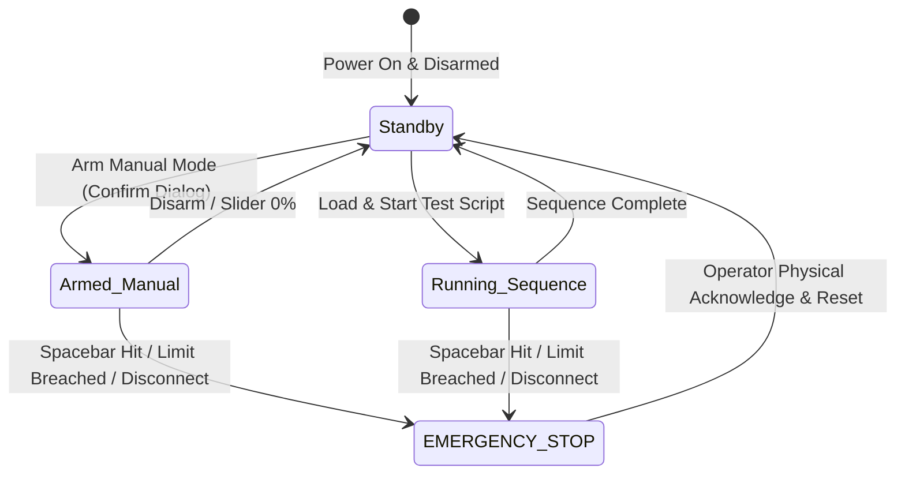

# 05 — Safety & Fail-Safe Specifications

Operating brushless motors spinning large propellers on a bench test stand presents immediate physical hazards. Safety is enforced through hardware watchdogs, firmware interlocks, and software tripwires.

---

## 1. Safety State Machine



---

## 2. Multi-Layer Safety Protections

### Layer 1: Hardware-Enforced Dead-Man Watchdog
* The software backend emits a heartbeat ping (`0xAA`) to the Arduino every **100 ms**.
* The Arduino firmware runs a non-blocking timer:
  ```cpp
  if (millis() - lastHeartbeatTime > 250) {
      triggerFailsafe(); // Cuts PWM to 1000us immediately
  }
  ```
* **Effect:** If the desktop application crashes, the USB cable is severed, or the operating system hangs, the motor cuts throttle within **250 ms**.

### Layer 2: Instant Software Emergency Stop (E-Stop)
* A dedicated full-width **Emergency Stop Button** is permanently pinned in the UI and hotkeyed globally to the **Spacebar** and **Escape** keys.
* Triggering the E-Stop immediately sends an interrupt packet overriding all test scripts, driving throttle to 0%, and detaching the PWM pin.

### Layer 3: Software Tripwires (Configurable Bounds)
The software automatically aborts tests if incoming sensor readings exceed safe thresholds:
* **Over-Current Tripwire:** If current exceeds the preset ESC rating (e.g., $45\text{ A}$ on a $50\text{ A}$ ESC) for $>100\text{ ms}$, abort.
* **Low-Voltage Cutoff:** If cell voltage drops below $3.3\text{ V/cell}$ ($9.9\text{ V}$ for 3S Micro, $13.2\text{ V}$ for 4S Advanced), raise an alert to prevent permanent LiPo battery damage.
* **Vibration / Load Cell Runaway:** If load cell readings register large negative forces or high-frequency oscillations indicative of structural failure, abort immediately.