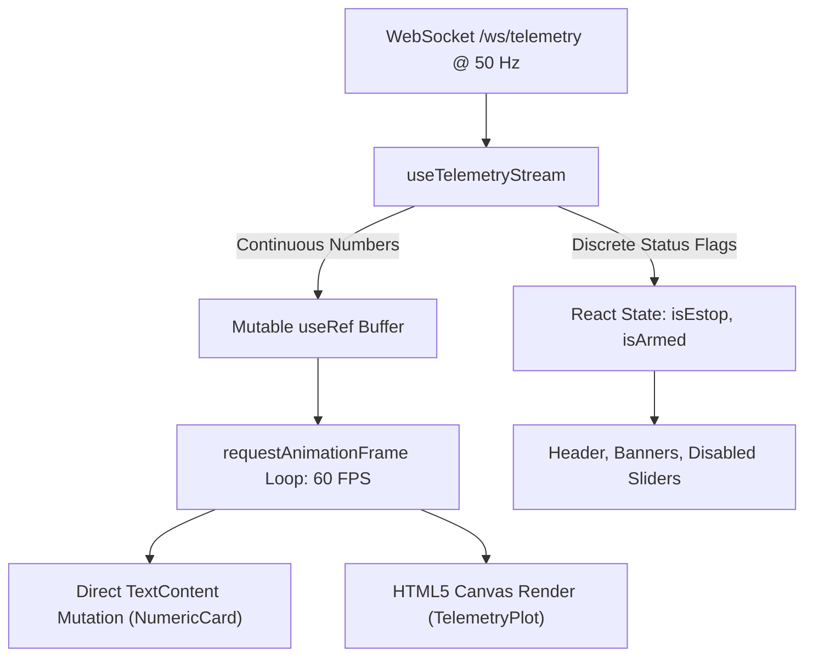

# AeroThrust V3 — Ground Station Frontend

The **AeroThrust V3 Frontend** is a real-time, desktop-native ground station interface built using **Tauri**, **React 18**, and **TypeScript**. It visualizes 50 Hz telemetry streams, enforces fail-safe motor interlocks, and logs test sessions for UBC AeroDesign’s propulsion test rig.

---

## 1. Architecture: The 60 FPS Non-Blocking Pipeline

To prevent **React render thrashing** (where updating state at 50 Hz pins the browser CPU at 100% and freezes the UI), the application splits state into two tiers:



1. **High-Frequency Tier (Direct-to-DOM / Canvas):** Numerical values (Thrust, Voltage, Current, RPM) are stored in an in-memory mutable `useRef`. A `requestAnimationFrame` graphics loop renders them directly onto HTML5 `<canvas>` elements and mutates `.textContent` on gauge cards, completely bypassing React reconciliation.
2. **Low-Frequency Tier (React State):** Discrete boolean states (`isEstop`, `isArmed`, `isHardwareStreaming`) trigger standard React state transitions, ensuring buttons, badges, and warning banners instantly update when safety events occur.

---

## 2. Key Features

* **Multi-Graph Split View:** Operators can toggle between:
  * **Single View:** Large dedicated display for a selected metric.
  * **Dual Split View:** Displays `Thrust & RPM` and `Electrical (V & A)` side by side.
  * **Grid (All 3):** Renders all time-series and cross-plot curves concurrently.
* **Fluid Window Resizing:** Native `ResizeObserver` instances calculate canvas pixel dimensions dynamically, preventing stretching or clipping on any monitor resolution.
* **Safety-First Actuation:**
  * Motor slider is physically disabled until the operator checks **ARM MOTOR**.
  * Quick-step micro buttons (`-1%`, `+1%`, `+5%`, `25%`, `IDLE`).
  * Global Emergency Stop bound to **Spacebar** and **Escape**, guarded against active form inputs.
* **Brand Identity Compliance:** Styled in accordance with UBC AeroDesign's 2023 Brand Guidelines (`#11273B` Navy, `#003565` Blue, `#C9D6EA` Ice Blue, `#ECEB2A` Yellow, `Titillium Web` headings, `Lato` body text).

---

## 3. Directory Layout

```text
frontend/src/
├── assets/                  # Official SVGs and branding icons
├── components/
│   ├── common/              # Modals and Badge pills
│   ├── controls/            # Hardware connection bar, Throttle slider, Session recorder
│   ├── instruments/         # 60 FPS Numeric cards, Tachometer, Battery gauge
│   ├── plots/               # Canvas TelemetryPlot and PlotControls switcher
│   └── safety/              # E-Stop button and warning banners
├── hooks/                   # useTelemetryStream, useKeyboardEStop, useUPlot
├── services/                # Typed REST API client & WebSocket definitions
├── styles/                  # theme.css with official AeroDesign CSS variables
└── types/                   # Telemetry and Session data contracts
```

---

## 4. Development & Running

### Prerequisites
* **Node.js 18+** and **npm**
* **Rust Toolchain** (`rustup`)

### Running in Development
```bash
# Inside frontend/ directory:
npm install

# Run desktop Tauri application (compiles Rust window + Vite dev server):
npm run tauri dev

# Alternatively, run purely in browser (without native desktop shell):
npm run dev
```
