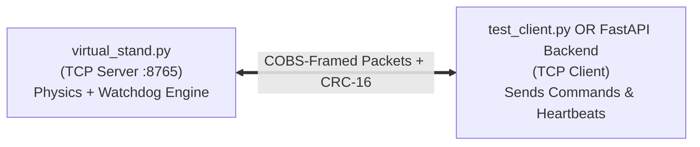

# Virtual Thrust Stand Hardware Simulator & Test Harness

This directory contains the software emulation tools for **AeroThrust V3**. These tools allow developers to build, test, and validate the backend telemetry ingestion and frontend visualization layers **completely offline without physical microcontroller hardware**.

---

## 1. Overview of Included Tools

* **`virtual_stand.py`:** An asynchronous Python server that emulates the STM32 test stand controller. It listens on a local TCP socket (`127.0.0.1:8765`), updates a real-time mathematical physics model of an electric motor and 4S LiPo battery, frames telemetry using **COBS** and **CRC-16-CCITT**, and enforces a **250 ms watchdog fail-safe**.
* **`test_client.py`:** A sample verification client that connects to the virtual stand, decodes streaming telemetry at $50\text{ Hz}$, prints human-readable telemetry tables to stdout, and emits periodic heartbeat keep-alives and throttle commands.



---

## 2. Prerequisites

* **Python 3.10+**
* **No external third-party dependencies required.** The simulator and test client use only standard library modules (`socket`, `struct`, `time`, `math`, `random`, `select`).

---

## 3. Quickstart: Running a Test Session

To observe the virtual hardware in action, open **two separate terminal windows**:

### Terminal 1: Launch the Virtual Stand
```bash
python sim/virtual_stand.py
```
*Expected Output:*
```text
======================================================================
 AeroThrust V3 - Virtual Stand Hardware Simulator
 Listening on TCP Socket -> 127.0.0.1:8765
 Press Ctrl+C to terminate.
======================================================================

Waiting for client connection from AeroThrust backend/GUI...
```

### Terminal 2: Run the Verification Client
```bash
python sim/test_client.py
```
*Expected Output:*
```text
Connecting to Virtual Stand at 127.0.0.1:8765...
Connected successfully! Starting 5-second test routine.

Time(ms) | Thrust(g) | Torque(g) | Voltage(V) | Current(A) | Power(W) | RPM   | Flags
--------------------------------------------------------------------------------
    20   |         0 |         0 |      16.78 |       0.81 |     13.6 |     0 | 0x0D
   120   |        15 |         2 |      16.74 |       1.42 |     23.8 |   850 | 0x0D
   220   |        84 |         8 |      16.68 |       3.15 |     52.5 |  2100 | 0x0D
   ...
```

---

## 4. Key Physics & Failure Modes Simulated

You can use the simulator to verify that our ground station software handles real-world edge cases properly:

1. **Watchdog Heartbeat Fail-Safe (Runaway Prevention):**
   * *Behavior:* The virtual stand requires a valid command or heartbeat (`0xAA`) at least once every **250 ms**.
   * *How to test:* Terminate `test_client.py` using `Ctrl+C` while the motor is spinning. Within 250 milliseconds, `virtual_stand.py` will log:
     ```text
     [FAILSAFE TRIGGERED] Watchdog heartbeat timed out (>250ms).
     ```
     The simulator immediately cuts target throttle to 0% and sets the `STATUS_ESTOP_ACTIVE` bit (`0x02`) in its telemetry flags.
2. **Motor Inertia Lag:**
   * Stepping throttle from 0% to 50% does not produce an instantaneous step in thrust. RPM and thrust ramp smoothly over ~300 ms, simulating physical rotor inertia.
3. **Battery Voltage Sag & Depletion:**
   * As current increases, bus voltage sags ($V = V_{\text{oc}} - I \cdot R_{\text{int}}$).
   * Over extended runs, the virtual battery steadily depletes, lowering nominal voltage.
4. **Sensor Commutation Noise:**
   * Load cells include synthetic Gaussian noise ($\pm 3\text{ g}$) to simulate air turbulence and mechanical vibration.

---

## 5. Packet Reference

All binary frames exchanged with the simulator adhere strictly to `docs/06_serial_protocol.md`:

* **Inbound Telemetry (Stand $\to$ Client):** 22-byte unencoded payload (Uptime, 4x Load Cells, Voltage, Current, RPM, Flags, CRC-16) encoded with COBS and terminated with `0x00`.
* **Outbound Command (Client $\to$ Stand):** 7-byte unencoded payload (Packet ID, Command, Value, Mode, CRC-16) encoded with COBS and terminated with `0x00`.